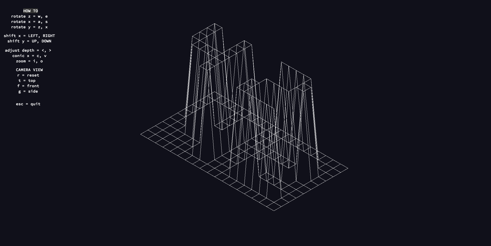

# 42_FDF
Basics of graphics programming, how to place points in space, connect them, and how to view the scene from a specific viewpoint.

## Usage

Compile 'make'

Run: (for example)  './fdf test_mapps/t1.fdf'

